# Mediarr

**Mediarr** is a web application for managing **posters**, **logos**, and **backdrops** for your movie and TV show library. It scans your media directories, shows what artwork is missing, and lets you download high-quality artwork from TMDb with a single click.

## Screenshots

### Main Collection View
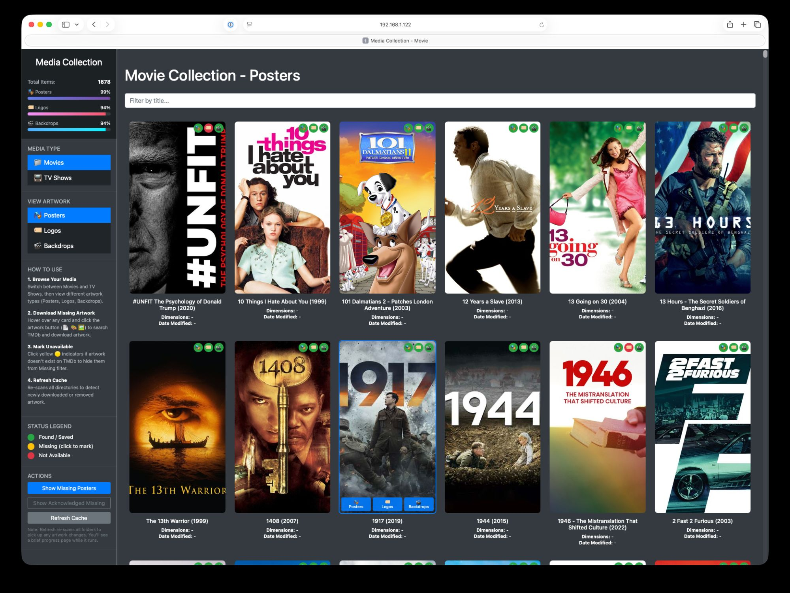
*Browse your entire media collection with visual status indicators showing which artwork exists (green), is missing (yellow), or is unavailable on TMDb (red).*

### Missing Artwork Filter
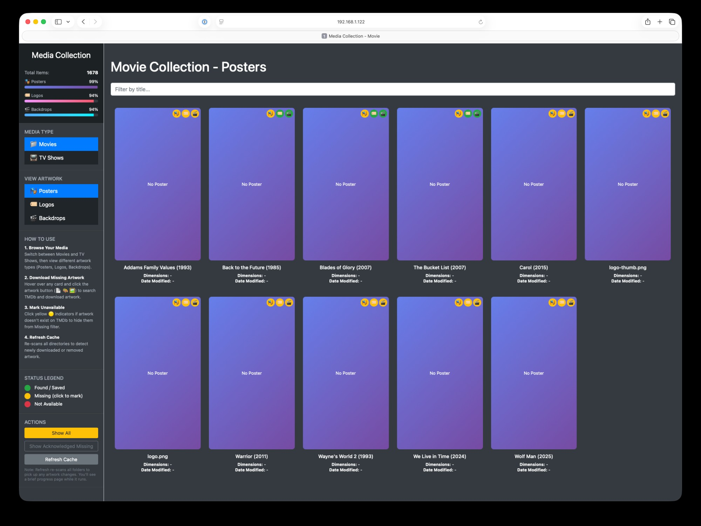
*Filter to show only items missing artwork. Work through your collection efficiently.*

### Card Hover Actions
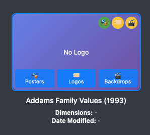
*Hover over any card to reveal download buttons for Posters, Logos, and Backdrops.*

### Search & Select Movie
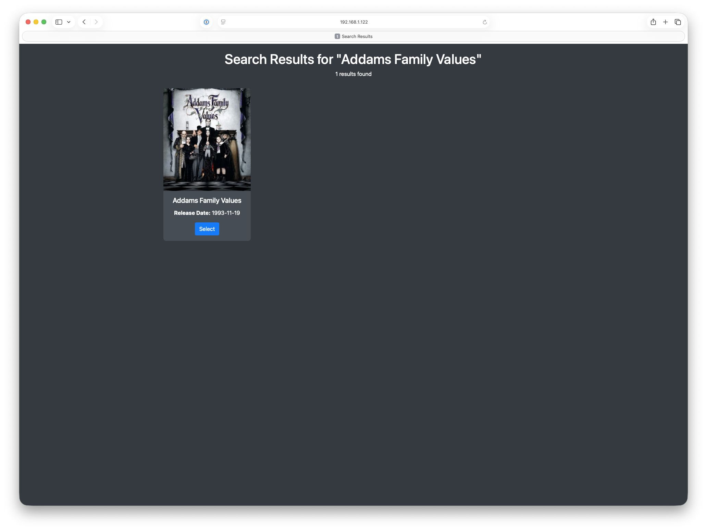
*Search TMDb to find the correct movie match with release date verification.*

### Choose Your Artwork
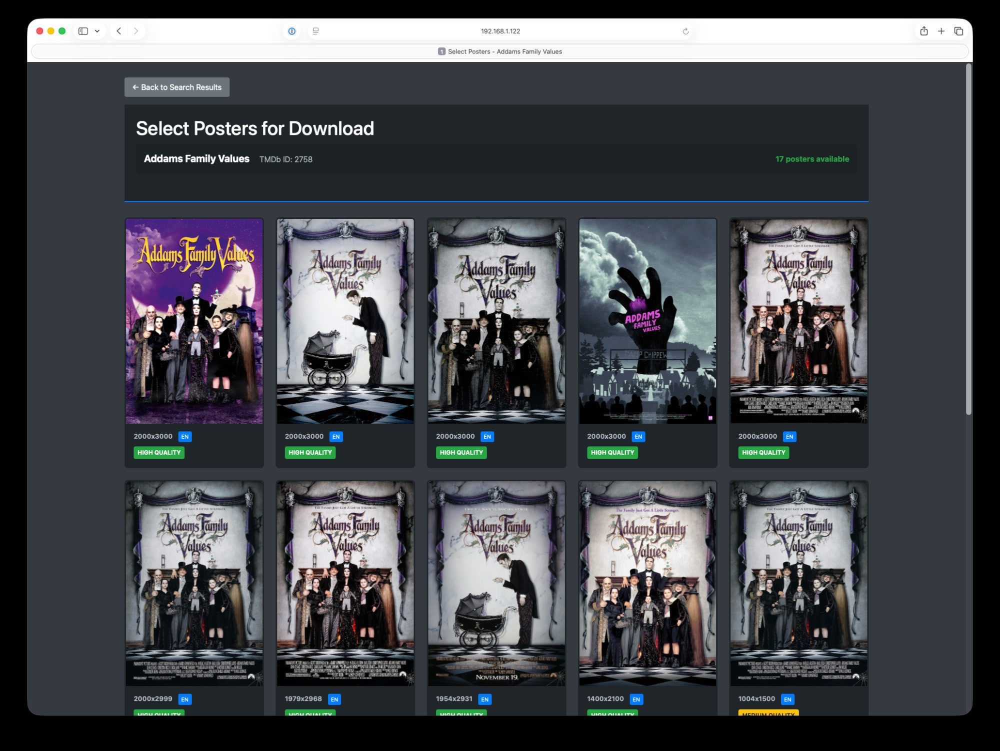
*Browse all available artwork with resolution, language, and quality indicators. Click to download.*

### After Download
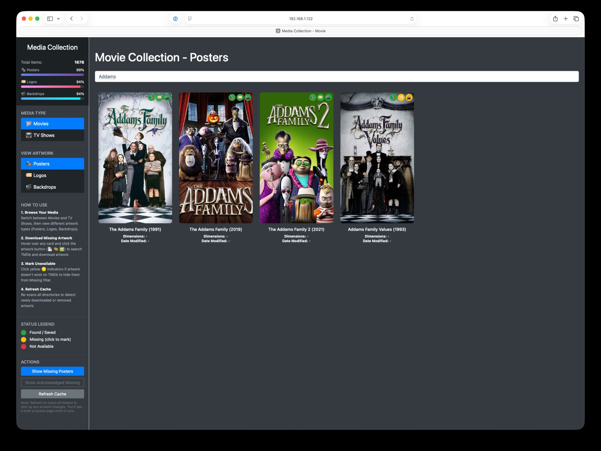
*Downloaded artwork appears immediately. Green indicators confirm success.*

### Logo Management
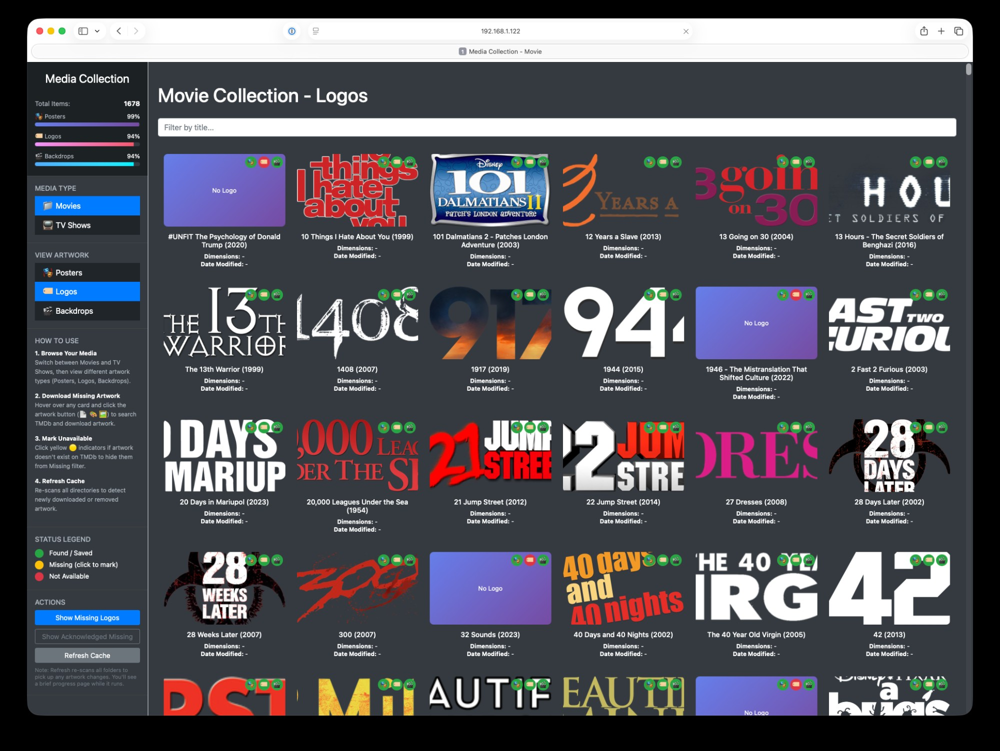
*View and manage logo artwork. Red indicators show titles marked as unavailable (no logo exists on TMDb).*

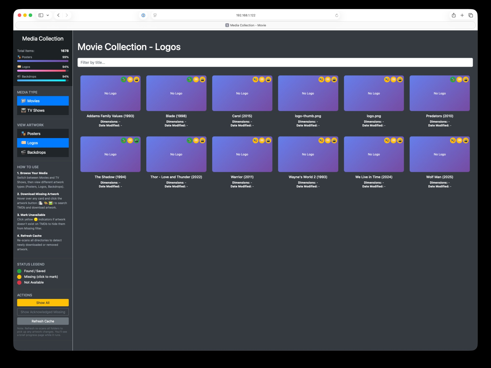
*Filter to missing logos only.*

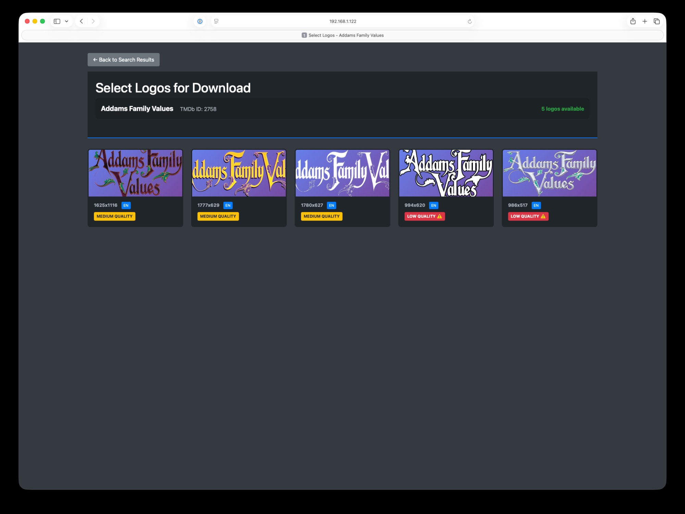
*Select from available logos with quality ratings (High/Medium/Low).*

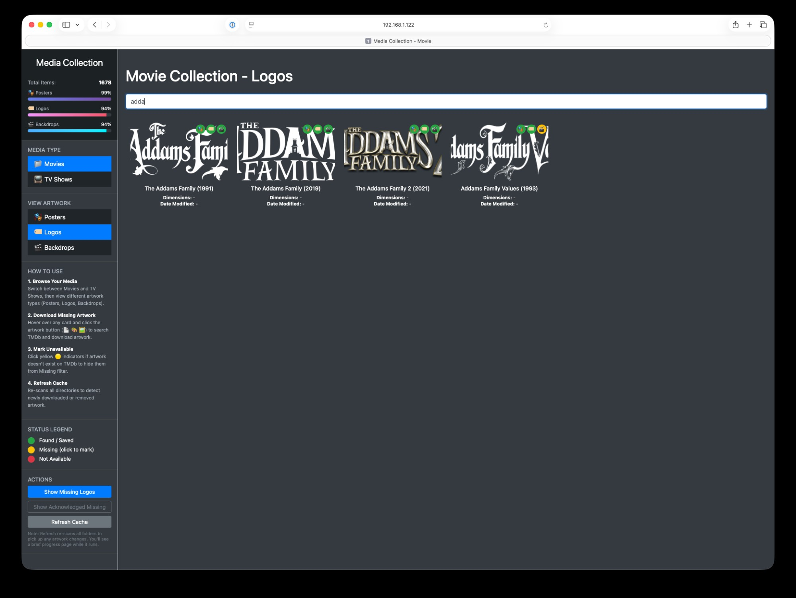
*Logo downloaded and indicators updated.*

### Backdrop Management
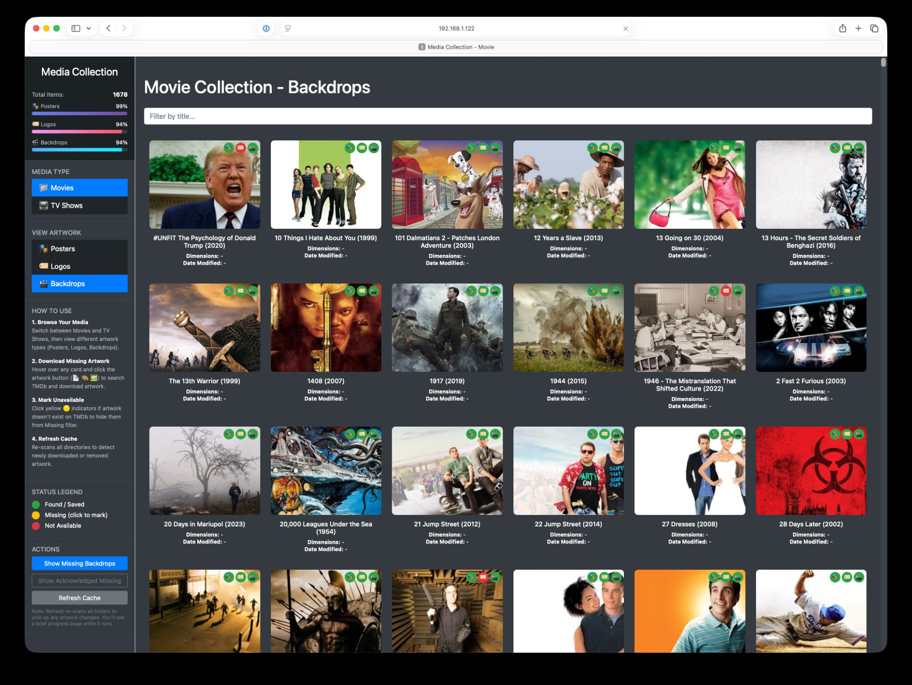
*Browse widescreen backdrop/fanart images for your collection.*

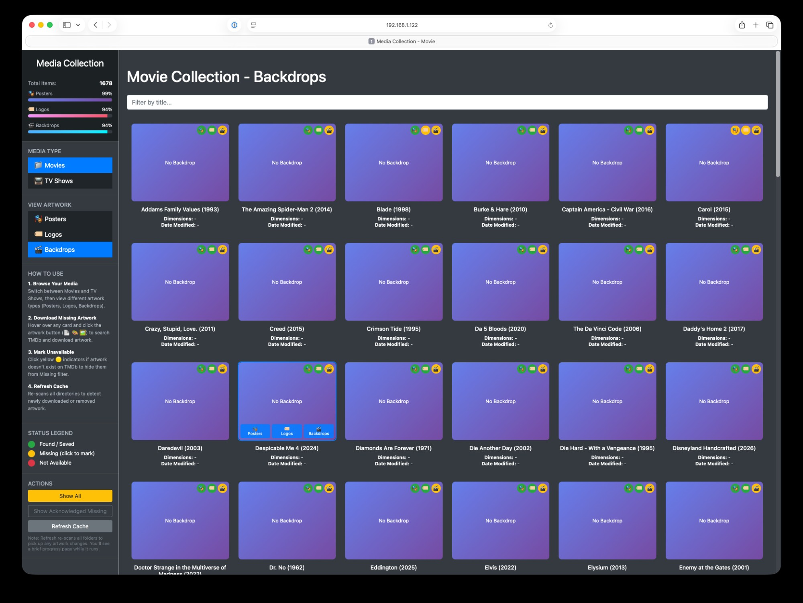
*Filter to missing backdrops. Hover state shows download buttons.*

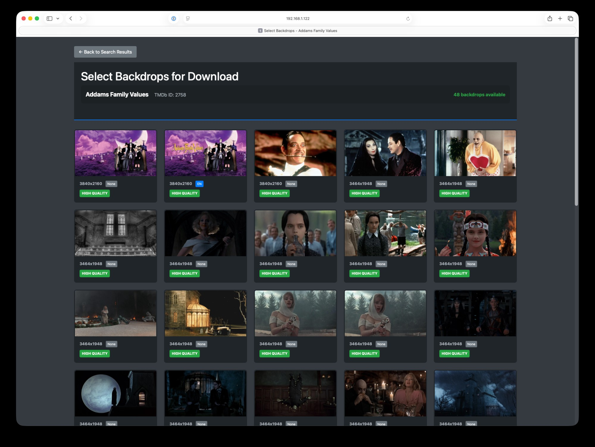
*Choose from dozens of available backdrops with resolution and quality info.*

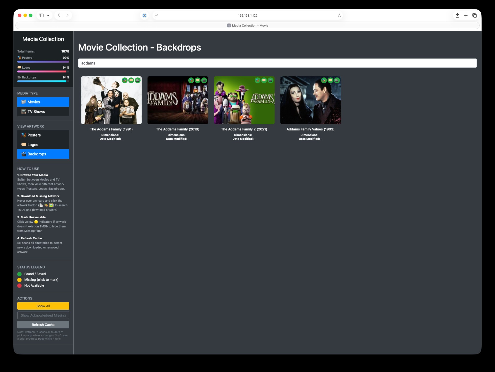
*Backdrop downloaded. All three indicators now green.*

---

## Features

- **Unified Artwork Management** - Handle posters, logos, and backdrops in one interface
- **Three-State Status Tracking**
  - **Green**: Artwork found and saved
  - **Yellow**: Artwork missing (click to search or mark unavailable)
  - **Red**: Marked as unavailable on TMDb
- **Smart Filtering** - Show all, show missing, or show acknowledged unavailable
- **Quality Indicators** - See resolution and quality ratings before downloading
- **Language Tags** - Filter by language when multiple options exist
- **Auto-Mark Unavailable** - Zero TMDb results automatically marks item as unavailable
- **SMB/NAS Optimized** - Adaptive throttling prevents mount overload
- **Background Scanning** - Initial scans run async with progress tracking
- **Checkpoint/Resume** - Scans can resume after container restart
- **Slack Notifications** - Optional alerts when artwork is downloaded

---

## Quick Start

### Docker Compose (Recommended)

```yaml
version: '3.8'

services:
  mediarr:
    image: swguru2004/mediarr:latest
    container_name: mediarr
    ports:
      - "6789:6789"
    environment:
      - TMDB_API_KEY=your_tmdb_api_key_here
      - MOVIE_FOLDERS=/movies,/kids-movies
      - TV_FOLDERS=/tv,/kids-tv,/anime
      - SLACK_WEBHOOK_URL=  # Optional
    volumes:
      - /path/to/movies:/movies
      - /path/to/kids-movies:/kids-movies
      - /path/to/tv:/tv
      - /path/to/kids-tv:/kids-tv
      - /path/to/anime:/anime
      - ./mediarr-data:/app/data
    restart: unless-stopped
```

### Start & Access

```bash
docker-compose up -d
# Open http://localhost:6789
```

---

## Requirements

- **TMDb API Key** - [Get one free](https://www.themoviedb.org/settings/api)
- **Media Library** - Movies/TV organized in directories with year: `Movie Name (2024)/`
- **Docker** (recommended) or Python 3.12+

---

## How It Works

### Status Indicators

Each card shows three colored dots indicating artwork status:
- **Poster** (left dot)
- **Logo** (middle dot)
- **Backdrop** (right dot)

| Color | Meaning | Action |
|-------|---------|--------|
| Green | Artwork exists | None needed |
| Yellow | Artwork missing | Click to search TMDb or mark unavailable |
| Red | Marked unavailable | Click to reset and search again |

### Workflow

1. **Browse** - Select Movies or TV Shows, then choose artwork type (Posters/Logos/Backdrops)
2. **Filter** - Click "Show Missing" to see only items without artwork
3. **Search** - Hover a card and click the artwork button to search TMDb
4. **Select** - Choose the movie/show match, then pick your preferred artwork
5. **Download** - Click any artwork to download it to your media folder
6. **Done** - Item automatically updates and disappears from missing filter

### TV Shows

TV Shows follow the same workflow as Movies - just select "TV Shows" in the sidebar.

---

## Configuration

### Environment Variables

| Variable | Required | Description |
|----------|----------|-------------|
| `TMDB_API_KEY` | Yes | Your TMDb API key |
| `MOVIE_FOLDERS` | Yes | Comma-separated movie paths |
| `TV_FOLDERS` | Yes | Comma-separated TV paths |
| `SLACK_WEBHOOK_URL` | No | Webhook for download notifications |

### Persistent Data

Mount `/app/data` to persist across restarts:
- Scan caches (avoid re-scanning on restart)
- Unavailability tracking
- Artwork thumbnails

---

## File Structure

Mediarr creates artwork files in your media directories:

```
Movie Name (2024)/
  poster.jpg           # Full poster
  poster-thumb.jpg     # Thumbnail for fast loading
  logo.png             # Transparent logo
  logo-thumb.png       # Logo thumbnail
  backdrop.jpg         # Widescreen backdrop
  backdrop-thumb.jpg   # Backdrop thumbnail
```

---

## Pro Tips

### Selecting Good Backdrops for Plex

The new Plex interface displays backdrops prominently. Choose wisely:

**Good choices:**
- No text overlays (UI elements will cover them)
- Subject on the right side (metadata displays on left)
- High resolution (2000px+ width)
- "None" language tag = no text, works internationally

**Avoid:**
- Centered compositions
- Text that will be obscured
- Low resolution (<1000px)

### Working Through Missing Artwork

1. Click "Show Missing [Artwork Type]"
2. Work through items - search TMDb for each
3. If TMDb has zero results, item auto-marks as unavailable
4. Use "Show Acknowledged Missing" to review previously marked items
5. Click red indicator to reset and try again

---

## Troubleshooting

### SMB/NAS Performance

Mediarr includes adaptive throttling for network mounts:
- Batched scanning (10 dirs, 2s pause)
- Automatic backoff on errors (5s-30s)
- Checkpoint/resume if scan is interrupted
- Zero SMB calls when switching tabs (uses cache derivation)

### Scan Stalling

If a scan stalls due to SMB stress:
- Restart the container
- Scan resumes from checkpoint automatically
- Try accessing during off-peak hours

### Artwork Not Appearing

1. Ensure directory format: `Movie Name (2024)/`
2. Check artwork files exist: `poster.jpg`, `logo.png`, `backdrop.jpg`
3. Click "Refresh Cache" to detect newly downloaded files
4. Verify file permissions

---

## Building from Source

```bash
git clone https://github.com/anthonysnyder/Mediarr.git
cd Mediarr

# Docker build
docker build -t mediarr .

# Multi-arch build & push
docker buildx build --platform linux/amd64,linux/arm64 \
  -t swguru2004/mediarr:latest --push .

# Local Python
pip install -r requirements.txt
python app.py
```

---

## License

MIT License - See `LICENSE` file.

## Acknowledgments

- **TMDb** for the excellent free API
- **Plex** for inspiring better artwork management

---

*Mediarr is not affiliated with TMDb or Plex.*
